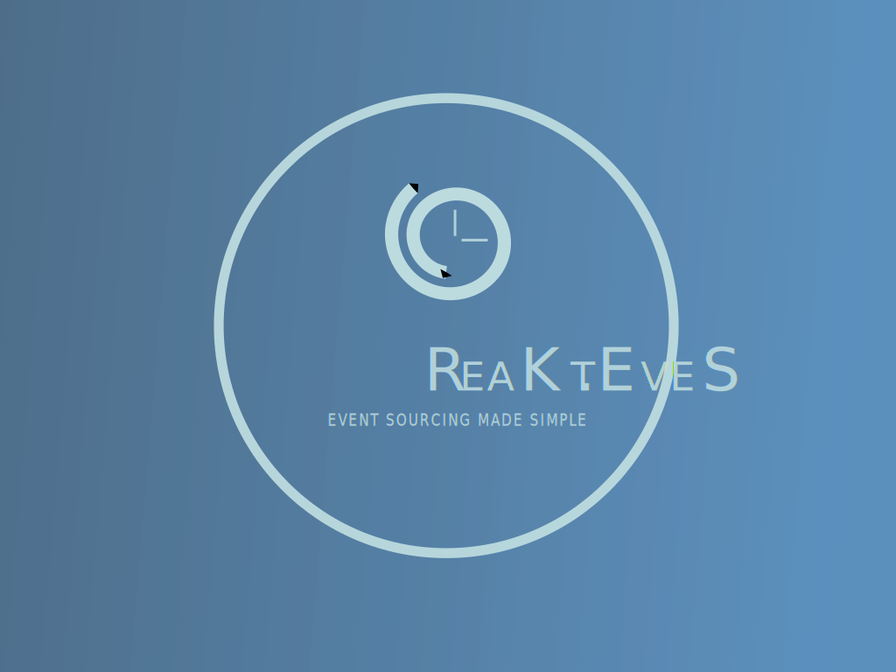

# ReaKt.EveS
Kotlin reactive library to ease event sourcing pattern integration in your Spring Webflux / Reactor projects

## Architecture

## More to come

## Acknowledgements
Publishing a library on Maven Central is such a path... I want to acknowledge the author of this great article that helped me to achieve this task :
https://getstream.io/blog/publishing-libraries-to-mavencentral-2021/

